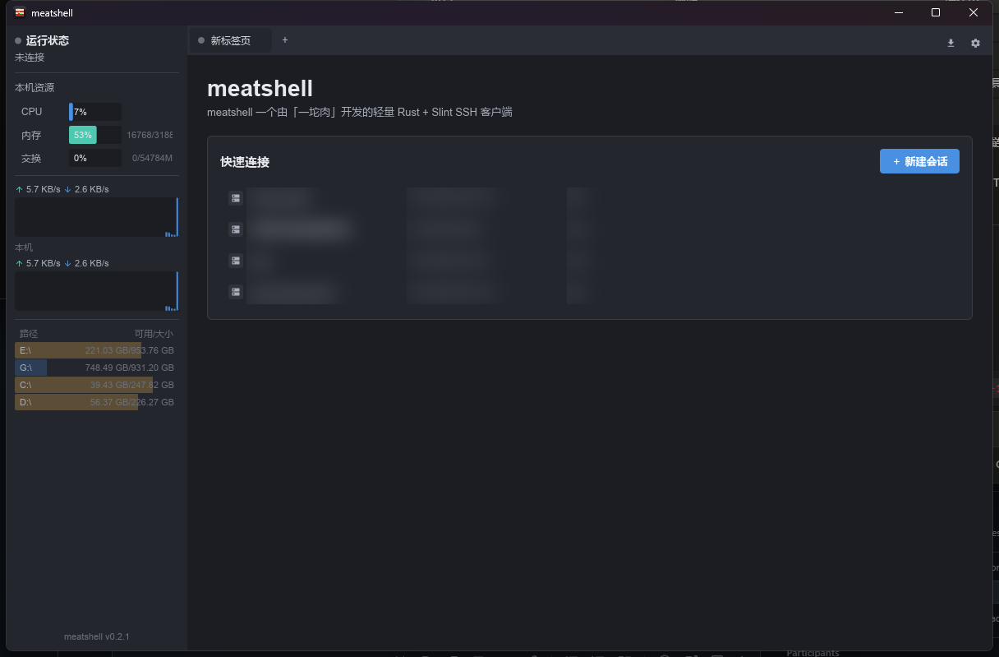
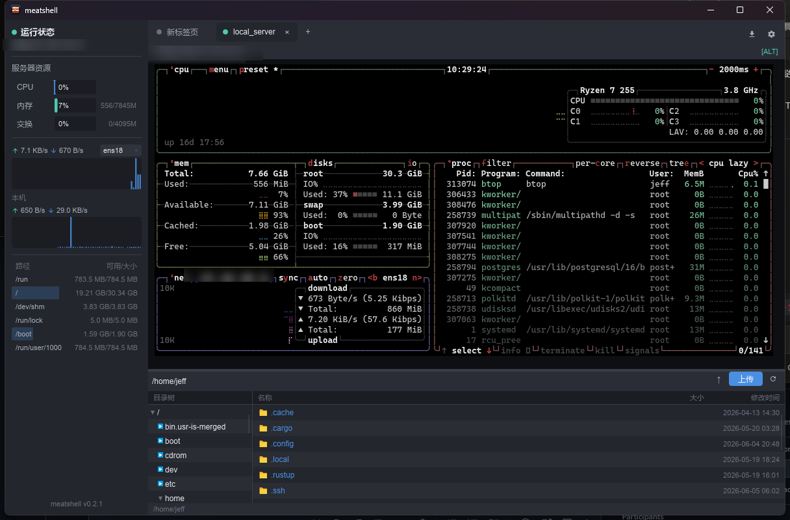

# meatshell

**简体中文** | [English](./README.en.md)

一个轻量级、低内存占用的 SSH / 终端客户端，灵感来自 FinalShell，但完全由
**Rust + [Slint](https://slint.dev)** 实现。目标是保留 FinalShell 的核心体验
（资源监控侧栏、会话管理、多标签页终端）的同时，把内存占用从 400 MB+ 的
JVM 压到几十 MB 原生级别。

## 截图

<p align="center">
  <br>
  <em>欢迎页：会话管理 + 左侧本机资源监控</em>
</p>

<p align="center">
  <br>
  <em>多标签页终端（btop 全屏渲染）+ 底部 SFTP 文件浏览 + 远端资源监控</em>
</p>

## 下载与安装

每次打 `v*` 标签，GitHub Actions 会自动构建 **Windows / Linux / macOS** 三平台二进制，
发布到 [Releases](https://github.com/zfloong/meatshell-app/releases) 页面。

### Windows

下载 `meatshell-*-windows-x86_64.zip`，解压后双击 `meatshell.exe`。

### Linux

```bash
tar -xzf meatshell-*-linux-x86_64.tar.gz
cd meatshell-*-linux-x86_64
./meatshell                                  # 直接运行
# 可选：装应用图标 + 启动器入口（Dock / 应用列表里显示图标，无需传参）
chmod +x install-linux.sh && ./install-linux.sh
```

> 需要 glibc ≥ 2.35（Ubuntu 22.04+ / Debian 12+）。Wayland 下首次装完图标可能要注销重登一次。

### macOS

```bash
tar -xzf meatshell-*-macos-*.tar.gz          # aarch64 = Apple 芯片，x86_64 = Intel
xattr -dr com.apple.quarantine meatshell     # 去掉「未签名应用」的 Gatekeeper 拦截
./meatshell
```

> 从源码构建见下方 [运行](#运行)。

## 功能

### 已实现

- [x] FinalShell 风格 UI，深色 / 浅色 / 跟随系统主题
- [x] 本机 + 远端资源监控（CPU / 内存 / 交换 / 网络 / 磁盘）
- [x] 远端进程监控（按 CPU 排序的只读进程表）
- [x] 完整 VT/ANSI 终端模拟（btop / htop / vim 全屏正常渲染）
- [x] 多标签页（欢迎页 + 多个会话）
- [x] 会话管理：新建 / 编辑 / 删除 / 分组，本地 JSON 持久化，导出 / 导入
  - 配置位置：`%APPDATA%/meatshell/sessions.json`（Windows）
    / `~/.config/meatshell/sessions.json`（Linux）
    / `~/Library/Application Support/meatshell/sessions.json`（macOS）
- [x] SSH（`russh`，纯 Rust）：密码 / 私钥 / 加密私钥（密码短语）
- [x] SFTP 文件浏览 + 上传 / 下载（拖拽）+ 终端内 ZMODEM（`sz`）接收
- [x] SSH 端口转发 / 隧道：本地 -L / 远程 -R / 动态 -D（SOCKS5）
- [x] 快捷命令 + 命令输入框（可群发到所有会话）+ 命令历史
- [x] 串口 / Telnet 会话
- [x] 出站代理（SOCKS5 / HTTP）
- [x] 导入 `~/.ssh/config`
- [x] 会话密码加密存储（ChaCha20-Poly1305）

### 计划中

- [ ] 已知主机 (known_hosts) 校验
- [ ] 会话密码改用 OS 钥匙串存储
- [ ] 多标签页终端分屏

## 技术栈

| 模块          | 选型                                                              |
| ------------- | ----------------------------------------------------------------- |
| UI            | [Slint](https://slint.dev)（纯 Rust 编译，无 GC）                 |
| 异步运行时    | [`tokio`](https://tokio.rs)                                       |
| SSH 协议      | [`russh`](https://crates.io/crates/russh)（无 libssh 依赖）       |
| 系统指标      | [`sysinfo`](https://crates.io/crates/sysinfo)                     |
| 序列化        | `serde` + `serde_json`                                            |
| 日志          | `tracing` + `tracing-subscriber`                                  |

## 运行

```bash
cargo run --release
```

首次启动会在 `%APPDATA%/meatshell/sessions.json` 建立空的会话库。点击右上
角 **“＋ 新建会话”** 添加第一台服务器。

## 项目布局

```
meatshell/
├── Cargo.toml
├── build.rs                 # Slint 编译器入口
├── ui/
│   ├── app.slint            # 顶层窗口
│   ├── theme.slint          # 设计 tokens
│   ├── widgets.slint        # 可复用按钮 / 输入框 / sparkline
│   ├── sidebar.slint        # 左侧系统监控面板
│   ├── tabs.slint           # 顶部标签栏
│   ├── welcome.slint        # 欢迎页 / 快速连接
│   ├── session_dialog.slint # 新建 / 编辑会话弹框
│   └── terminal_view.slint  # 终端视图（v0.1 行缓冲）
└── src/
    ├── main.rs
    ├── app.rs               # UI ↔ 后端桥接
    ├── config.rs            # 会话 JSON 持久化
    ├── system.rs            # CPU / 内存 / 网络采样
    └── ssh.rs               # SSH 会话 worker
```

## 开发提示

- Slint 控件有非常严格的布局 DSL，改 `.slint` 后 `cargo check` 是最快的
  反馈方式。
- 应用事件循环是单线程（Slint 要求），所有跨线程 UI 更新通过
  `slint::invoke_from_event_loop` 回调。
- 目前 `check_server_key` 接受任意服务端密钥（类似 `StrictHostKeyChecking=no`），
  生产使用前请接入 known_hosts 校验。

## 赞赏 / 请我喝杯咖啡

觉得作品还不错的话，请我喝杯咖啡吧 ☕

<p align="center">
  <strong>亮出网络乞丐乞讨专用码</strong><br>
  
</p>

## License

MIT OR Apache-2.0（双许可）。
